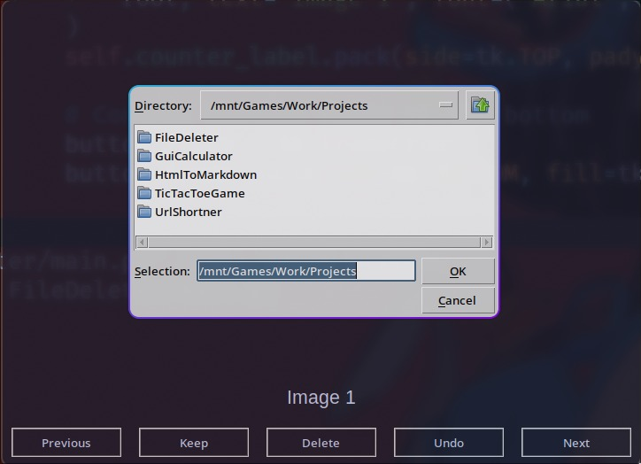
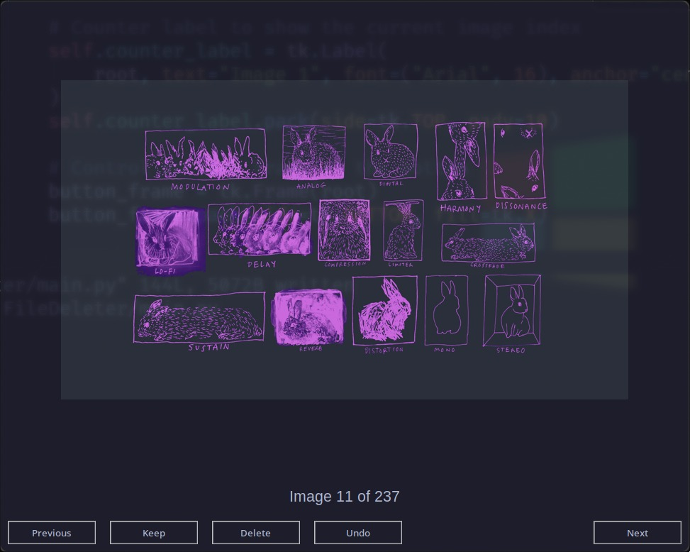

# Image Filter App 🖼️

Ever wondered if you could swipe left or right through your image collection like a dating app for files? Well, _filter_ no more! Welcome to **Image Filter App**, where your photos are sorted, loved, or kicked to the recycle bin with ease.

## Overview 🤹‍♀️

The **Image Filter App** lets you browse through a folder of images, review them one by one, and decide whether to keep or delete them. If you delete an image by mistake, there's even an _undo_ feature to save the day. Think of it as a playful judge and jury for your image gallery—but no need to take it too seriously, we won't hurt anyone's _pixels_.

## Features 🎨

- **Keep or Delete**: Easily manage your images with "Keep" and "Delete" options.
- **Undo Deletion**: Mistakes happen—bring back accidentally deleted images.
- **Next/Previous Navigation**: Browse forward and backward through your collection.
- **Image Counter**: Always know where you are in your photo lineup.
- **Support for Popular Formats**: Works with `.png`, `.jpg`, `.jpeg`, `.bmp`, and `.gif`.

## Screenshots 📸

### 1. Image Selection Dialog



### 2. Image Viewer Interface



## Installation 💻

<!--- TODO: add repo link here  -->

1. Clone this repository:

   ```bash
   git clone https://github.com/ss/gui-calculator.git

   ```

2. Navigate to the project folder:

   ```bash
   cd gui-calculator

   ```

3. Install the required dependencies:
   ```bash
   pip install pillow
   ```
4. Download the script and run it:
   ```bash
   python image_filter_app.py
   ```

## Usage 🏃‍♂️

1. Run the script, and select a folder containing your images.
2. Use the following controls:
   - **Previous**: Go back to the previous image.
   - **Keep**: Skip to the next image without making changes.
   - **Delete**: Remove the current image from the folder.
   - **Undo**: Restore the last deleted image.
   - **Next**: Skip to the next image.

## How It Works ⚙️

1. The app opens a dialog to let you select a folder with images.
2. Images are displayed one at a time in a user-friendly interface.
3. Deleted files are moved to oblivion, but you can undo if you change your mind.

## Requirements 📋

- Python 3.6 or higher
- Pillow (Python Imaging Library)
